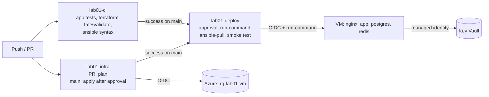
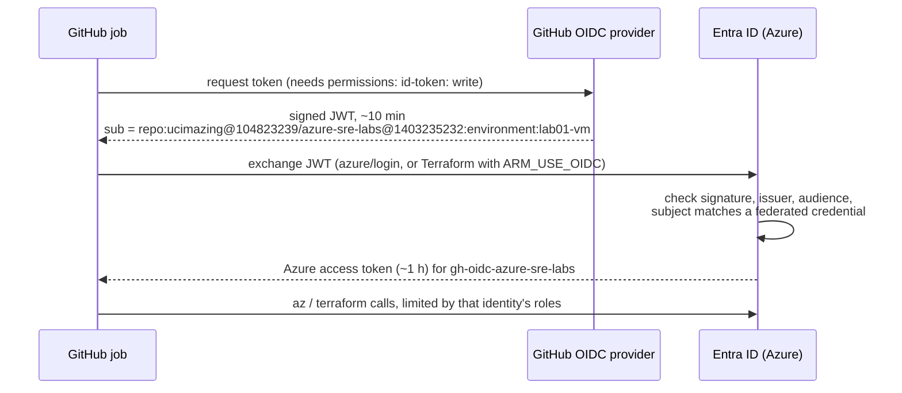
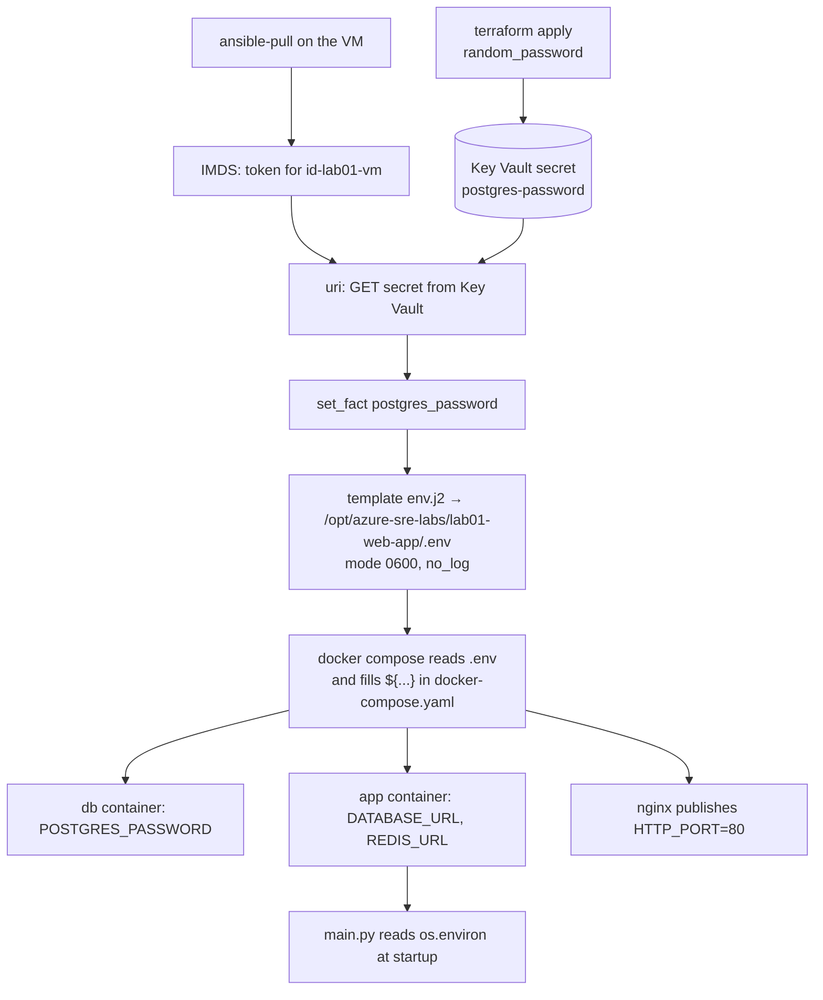

# Lab 01 Recap: from `docker run` to a fully automated Azure deployment

Written 2026-10-08. Covers Lab 0 (account setup) and Lab 1 (web app), local and on Azure.
Facts in this file (run counts, callers, versions) were taken from the real repo, GitHub and Azure on that date.

---

## 1. What we built

### The end result
Every change to `main` is tested, deployed to an Azure VM and tested again on the live VM.
No password, client secret or SSH key is stored in GitHub, and nobody types the database password.

### Step by step

| # | What | Where | Tools |
|---|---|---|---|
| 0 | Account setup: Terraform state storage, GitHub OIDC identity, repo variables | `rg-tfstate`, Entra ID | Terraform, az CLI |
| 1 | Shared app: items CRUD, Postgres, Redis cache, `/healthz` and `/readyz` | `app/` | FastAPI (written by Claude) |
| 2 | Container image | `app/Dockerfile` | Docker |
| 3 | Containers by hand, to learn networking and env vars | — | `docker run`, networks |
| 4 | Full local stack | `lab01-web-app/docker-compose.yaml` | Compose, healthchecks, volumes |
| 5 | Reverse proxy in front of the app | `lab01-web-app/nginx/default.conf` | Nginx |
| 6 | One-word commands: `make up / test / down` | `lab01-web-app/Makefile` | Make |
| 7 | Break-it exercises and a runbook | `lab01-web-app/RUNBOOK.md` | — |
| 8 | Infrastructure: RG, VNet, subnet, NSG, public IP, VM | `lab01-web-app/terraform/` | Terraform, remote state |
| 9 | Server configuration and deploy | `lab01-web-app/ansible/` | Ansible |
| 10 | Secrets: generated password in Key Vault, read by the VM's identity | `terraform/keyvault.tf`, playbook | Key Vault, managed identity, IMDS |
| 11 | CI | `.github/workflows/lab01-ci.yaml` | GitHub Actions |
| 12 | Infra pipeline: plan on PR, apply after approval | `.github/workflows/lab01-infra.yaml` | Actions, OIDC, Environments |
| 13 | CD: deploy and smoke test | `.github/workflows/lab01-deploy.yaml`, `deploy/remote-deploy.sh` | run-command, ansible-pull |

### What exists in Azure now

| Resource | Name | Lives in | Notes |
|---|---|---|---|
| State storage | `sttfstate557486d7ce` | `rg-tfstate` | **never delete**. Versioned: `lab01-vm.tfstate` has 87 versions so far |
| CI identity | `gh-oidc-azure-sre-labs` (client `994c92b1…`) | Entra ID | Contributor, a limited RBAC admin role, state blob access |
| VM | `vmm`, Standard_B2as_v2, Ubuntu 24.04 | `rg-lab01-vm` | about $0.11/hr while running |
| Key Vault | `kv-lab01-<random>` | `rg-lab01-vm` | the name changes on every rebuild |
| VM identity | `id-lab01-vm` (user-assigned) | `rg-lab01-vm` | Key Vault Secrets **User** (read only) |
| Network | `vmvnet` / `vmsub` / `vmnsg` / `ipvm` | `rg-lab01-vm` | SSH from your IP only, HTTP 80 from the internet |

Pipeline history so far: lab01-ci 7/7 green, lab01-infra 2/2, lab01-deploy 1 failure (fixed) and 1 success.

---

## 2. Challenges we hit, and how they were solved

Grouped by layer. Each one taught something you'll see again in real jobs.

### Docker and Compose

| Symptom | Cause | Fix and lesson |
|---|---|---|
| `bind: address already in use` on 8080 | another program on the Mac owned port 8080 | moved to 8088. **Check who owns a port**: `lsof -i :8080` |
| `exec: "uvicorn": executable file not found in $PATH` | `USER appuser` came before `pip install`, so packages went to `~/.local/bin`, which isn't on `PATH` | install as root first, switch to the user last. **Order of Dockerfile lines matters** |
| `RUN uvicorn …` | `RUN` runs at **build** time; `CMD` runs at **start** | use `CMD` for the start command |
| app exited, `Name or service not known` | `DATABASE_URL` still contained the placeholder `HOST` | **"Name or service not known" = DNS: the hostname doesn't exist** |
| `/readyz` showed no Redis, then `redis: fail` | first `REDIS_URL` was missing, then it pointed at `lab01-cache` (a Step 2 name) | in Compose, **the service name is the hostname** |
| empty env vars in containers | `- ${VAR}` in an `environment:` list (a value with no name) | **`.env` only fills `${…}` placeholders in the YAML.** Containers get only what you list as `NAME=value`. Check with `docker compose config` |
| Nginx would not start (or empty directory mounted) | mount path `./default.conf` but the file lives in `./nginx/` | Docker creates a **directory** when a bind-mount source is missing |
| first request after `make up` gets **502** | the app has no healthcheck, so `--wait` returns before uvicorn listens | CI now polls `/readyz` with retries. **Still open:** add an app healthcheck (runbook #0) |
| `kill` not found in the container | slim images don't ship `procps`; `kill` is a shell built-in | `docker compose exec app sh -c 'kill 1'` |

### Azure account and quotas

| Symptom | Cause | Fix and lesson |
|---|---|---|
| every B-series size `NotAvailableForSubscription` in Central India | free-trial subscriptions are restricted per region and size | moved to **South India**, size **B2as_v2**. Check with `az vm list-skus --all` |
| budget API not supported | Cost Management budgets don't work on the Free Trial offer | rely on the trial's spending limit. Watch the credit in the portal |
| Terraform `401 wrong issuer`, `AADSTS700016` | old account's `ARM_TENANT_ID`, `ARM_CLIENT_ID` and `ARM_CLIENT_SECRET` exported in `~/.zshrc` | disabled those lines. **`ARM_*` environment variables override `az login`**. Also: a client secret sat in plain text in a dotfile |

### Terraform

| Symptom | Cause | Fix and lesson |
|---|---|---|
| `Can't access attributes on a set of objects` | subnet defined **inline** in the VNet | separate `azurerm_subnet` resource |
| plan would fail at apply | `.id` passed where `.name` was expected | **read the argument name**: `*_name` wants `.name`, `*_id` wants `.id` |
| NSG rules incomplete | no source or destination fields | every rule needs source, destination and ports. Azure's **default rules** already allow outbound internet and deny other inbound |
| `principal_id` missing at plan time | a **system-assigned** identity doesn't exist until the VM is updated | **user-assigned** identity: created first, survives VM replacement, can be shared |
| writing the secret: `403 Forbidden` | (a) Owner is **control plane** only; secrets are **data plane**. (b) New roles take 1–5 min to propagate | (a) Secrets Officer role. (b) `time_sleep` of 120 s before writing the secret |
| `validate` fails on a GitHub runner | `file("~/.ssh/id_ed25519.pub")` only exists on your Mac | public key passed as a **variable** (`TF_VAR_ssh_public_key`) |
| your home IP would appear in public CI logs | the repo, and therefore its Actions logs, are public | `sensitive = true` on `admin_cidr` |
| local apply vs CI apply would fight over a role | `me_secrets` granted to *whoever runs Terraform* | **CI applies; humans plan.** Your access is a separate fixed assignment (`admin_secrets`) |
| CI could not grant Key Vault roles | CI's RBAC admin role is **conditional**: originally AcrPull/AcrPush only | you widened the condition by hand. **Not in code**, so keep it documented |

### Ansible

| Symptom | Cause | Fix and lesson |
|---|---|---|
| `No package matching 'docker-ce'` | `--check` only pretends, so the Docker repo was never really added | dry runs can't simulate steps that depend on each other |
| deprecation warning on `ansible_distribution_release` | fact injection is going away | use `ansible_facts['distribution_release']` |
| template task failed with a "censored" error | folder `template/` vs `templates/`, and `no_log` hid the message | **`no_log` hides errors too.** The task name tells you where; check its inputs |
| SSH "not working" / host unreachable | quoted output (`"ssh …"`), a booting VM, and later a **stale IP** in `inventory.ini` after CI rebuilt the VM | `terraform output -raw`; generate the inventory from Terraform |
| CD failed: `Unsupported parameters … module: wait` | the VM's Ubuntu Ansible ships community.docker **3.7.0**; your Mac has 5.x | pinned collections in `requirements.yml` (4.x). **Pin dependency versions** |

### CI/CD

| Symptom | Cause | Fix and lesson |
|---|---|---|
| unformatted file passed locally, failed in CI | nobody ran `terraform fmt` | the CI `fmt -check` job. **CI catches what laptops forget** |
| `run-command` said "succeeded" but the deploy was broken | run-command only reports that the command was **delivered** | the script prints `DEPLOY_OK <sha>` last, and the workflow fails without it |
| deploy must be exactly what CI tested | "latest main" can change between CI and deploy | deploy `workflow_run.head_sha`, and `ansible-pull --checkout <sha>` |

### Honest note on process
Some problems came from Claude's side too: building DevOps files you wanted to write yourself, a wrong `kill` command in the exercises, and an incomplete test (checked that a module *exists*, not that it accepts every *parameter*). The lesson applies to anyone: **test in a clean environment that matches the target**, not on your own laptop.

---

## 3. Key learnings

**Containers**
- Image = recipe plus ingredients (build time). Container = a running instance (run time).
- Layer caching: put rarely-changing steps (dependencies) before frequently-changing ones (code).
- `0.0.0.0` inside a container; `localhost` means *the container itself*.
- Run as non-root (least privilege). Kubernetes often enforces this.
- Container data is lost on `rm` unless it's in a **named volume**.

**Networking and debugging**
- On a user-defined network, the container/service **name is the hostname** (Docker DNS).
- **Connection refused** = the host was reached but nothing listens. **Timeout** = blocked by a firewall or the host is unreachable.
- 502/504 from Nginx = the problem is between Nginx and the app. 503 from the app = the problem is behind the app.
- Debug order: is it running (`ps`)? why did it die (`logs`, bottom-up)? what config did it get (`inspect`, `compose config`)?

**Reliability**
- Liveness (`/healthz`) must never check dependencies, or a DB outage causes a **restart storm**. Readiness (`/readyz`) does check them.
- A cache must degrade gracefully, and changing data behind the cache's back gives **stale reads**.
- `POSTGRES_PASSWORD` only applies on the **first** start of an empty volume.

**Terraform**
- State maps code to real resources. It holds **secrets**, so protect it like a secret store.
- `plan` compares code with **refreshed reality**. Look for `-/+` (replace) before you type `yes`.
- References build the dependency graph; `depends_on` covers hidden dependencies.
- Owner (control plane) ≠ data access (data plane). RBAC changes take minutes to propagate.

**Ansible**
- Agentless (SSH + Python), declarative, **idempotent**: a second run shows `changed=0`.
- Modules run **on the managed host**. That's why IMDS works from a playbook task.
- `register`, `set_fact`, `template`, `no_log`, `-e`, and `group_vars` loading by group name.
- Pull mode (`ansible-pull`): the server configures itself from git.

**Security**
- No long-lived secrets: OIDC for CI, managed identity for the VM, SSH keys for humans.
- Least privilege everywhere: read-only role for the VM, `contents: read` in workflows, a conditional RBAC admin role for CI.
- In a public repo, **assume every log line is public**.

**CI/CD**
- CI runs **the same commands** you run locally (`make up`, `make test`).
- Plans on PRs; applies only from `main` after approval; never cancel an apply halfway.
- Deploy the **exact tested commit**, then **test the live system** (smoke test).
- Don't trust "succeeded": verify the outcome.

---

## 4. Your questions, answered

### Q1. How does the OIDC passwordless login work here?

There are **two separate passwordless mechanisms** in this lab, plus SSH keys for you:

| Who logs in | To what | How |
|---|---|---|
| GitHub Actions | Azure | **OIDC workload identity federation** |
| The VM | Key Vault | **managed identity** via IMDS |
| You | the VM | SSH key pair (public key on the VM, private key on your Mac) |

**GitHub → Azure (OIDC), step by step:**

The **subject** decides which credential matches, and therefore whether the login works at all:

| Federated credential | Subject ends with | Used by |
|---|---|---|
| `gh-pr` | `:pull_request` | `lab01-infra` → `plan` job |
| `gh-env-lab01-vm` | `:environment:lab01-vm` | `lab01-infra` → `apply`, `lab01-deploy` |
| `gh-main` | `:ref:refs/heads/main` | `whoami` (jobs on main without an environment) |

`lab01-ci` doesn't log in to Azure at all. It needs no cloud access.

What's stored in GitHub: only **IDs**, as plain repo *variables* (client, tenant and subscription IDs). They're useless without a GitHub-signed token for **this repo**. The immutable-ID subject (`ucimazing@104823239/…@1403235232`) means even renaming the repo, or someone re-creating it, can't reuse the trust.

**VM → Key Vault (managed identity):** the VM has the user-assigned identity `id-lab01-vm`. A playbook task on the VM calls `http://169.254.169.254/metadata/identity/oauth2/token`. That's **IMDS**, reachable only from inside that VM, and it returns a token for that identity. The token is then used on Key Vault's REST API. Azure handles the identity's credentials; none ever exist in a file.

### Q2. If I destroy and create many times, how does the app keep running when the public IP changes?

Short answer: **it doesn't keep running across a destroy.** Each `destroy` removes everything, and each `apply` builds a new VM, usually with a **new public IP**. `allocation_method = "Static"` means the IP is stable *for the lifetime of that IP resource*; it isn't kept after the resource is destroyed.

What **does** keep working, because nothing hardcodes the IP:
- `lab01-deploy` reads `public_ip` from Terraform **state** on every run, then deploys and tests against it.
- Your local `terraform output public_ip` reads the same remote state.

What **breaks** after a rebuild:
- `ansible/inventory.ini` keeps the old IP. You hit this. Fix: generate it from `terraform output`.
- `~/.ssh/known_hosts`: the new VM has a new host key, so SSH warns. Fix: `ssh-keygen -R <ip>`.
- Anyone using the old IP, including a future DNS name.
- The Key Vault name and identity client ID also change, which is handled because they're read from outputs.

The real-world fixes, coming in later labs:
- **A DNS name managed by Terraform** (Lab 10). The record points at the current IP and is updated on every apply. Users use the name, never the IP.
- **Split long-lived "pets" from short-lived "cattle"**: keep the public IP, DNS and Key Vault in a separate resource group and state that you don't destroy, and recreate only the VM.
- A **load balancer** in front (Lab 2): its IP stays while VMs come and go.

Also: a destroy/apply done **from your Mac** doesn't trigger `lab01-deploy`, which only runs after CI or infra **workflows** succeed. After a local apply, start the deploy by hand with `gh workflow run lab01-deploy`.

### Q3. How do we track who ran `terraform apply` or changed the infrastructure?

Several sources, each answering a different question:

| Question | Where to look | Example from this lab |
|---|---|---|
| **What** changed in code, and why? | git history and PRs | `git log`, PR #2 to #4, each with a description |
| **Who approved** the change to Azure? | GitHub → environment **lab01-vm** → deployment history, and each run's "Review deployments" | deployments of `9924151`, `a513151`, `06a5986` to `lab01-vm` |
| **Which pipeline run** did it, at which commit? | the Actions run log | `lab01-infra` → `apply` job, with the plan it applied |
| **Who called Azure**, exactly? | **Azure Activity Log** (portal → resource group → Activity log, or `az monitor activity-log list`) | callers seen: **`umesh513…`** (your local applies and destroys) and **`b5a49b2f…`** (the CI service principal, object ID of `gh-oidc-azure-sre-labs`) |
| What did the state look like before? | **state blob versions** in `sttfstate557486d7ce` | `lab01-vm.tfstate`: 87 versions, any of which can be restored |

Note the gap: Azure only records **the CI identity** as the caller, not the human. You connect the two through the GitHub run (who merged, who approved). Also, you can still apply from your Mac because you're Owner, and nothing *enforces* "CI only". Industry closes this by:
- giving humans **read-only** access to production, so only the pipeline's identity can change it
- sending Activity Logs to a **Log Analytics workspace** with alerts, for example "infrastructure change not made by the CI identity"
- tagging resources with `managed_by = terraform` and the git SHA

### Q4. After destroy and create, is all the database data gone?

**Yes, all of it, by design of this lab:**
- Postgres data lives in the Docker **named volume** `postgres_data` on the **VM's OS disk**. `destroy` deletes the VM *and* its disk, so the volume and every row are gone.
- The **password** goes too. `random_password` is destroyed, and a new one is generated on the next apply. The Key Vault itself is deleted and **purged**: purge protection is off for the lab.
- Redis data goes too, but it's only a cache.

That's also why a rebuild "just works": a new empty volume plus a new password, so they match. **Runbook #7** shows what happens when the disk survives but the password changes.

Your **local** stack is different: its volume `lab01-web-app_postgres_data` survives `make down` and is removed only by `make nuke`.

How real systems keep data:
- a **managed database** (Azure Database for PostgreSQL Flexible Server), with automatic backups and point-in-time restore, in a **separate long-lived** resource group and state
- or a separate data disk with `prevent_destroy`
- plus **backups** stored elsewhere (Blob Storage) and regularly **tested restores**: Lab 12

### Q5. How are environment variables created and passed to the app? Is a new one created after each destroy/create?

**On the VM, every deploy:**

| Where | Where `.env` comes from | Values |
|---|---|---|
| your Mac | `make up` copies `.env.example` the first time | your own local password |
| CI (`lab01-ci`) | `make up` copies `.env.example` | **fake values**: CI tests code, not production |
| the VM | the Ansible template, filled from **Key Vault**, **on every deploy** | the generated password |

**Is it recreated?**
- On **every deploy**, the template is rendered again. If nothing changed, Ansible reports `ok` and Compose leaves the containers alone.
- After **destroy + create**: a new password in a new Key Vault, so the first deploy writes a new `.env`, and a new empty database is initialised with it.
- If the secret changes **without** a rebuild, for example a manual rotation in Key Vault: the next deploy writes the new password into `.env`, but the existing Postgres volume still has the old one. That's runbook #7. Real password rotation has to change it **inside Postgres** first.

---

## 5. Edge cases and corner cases where the deployment can fail

| # | Scenario | What fails | Handled? |
|---|---|---|---|
| 1 | Fresh build: the new role hasn't propagated to Key Vault after 120 s | secret write `403` in `apply` | partly (`time_sleep`). Re-run the apply |
| 2 | `run-command` succeeds but the script fails | broken deploy shown as green | ✅ the `DEPLOY_OK` check |
| 3 | two `run-command`s on the same VM at once (CI and infra both finish) | `Conflict: run command extension execution is in progress` | ✅ the deploy `concurrency` group queues them |
| 4 | Ansible or collection versions differ between machines | `Unsupported parameters …` | ✅ pinned `requirements.yml`. Ubuntu's apt Ansible can still change with new images (`version = "latest"`) |
| 5 | right after start, Nginx can't reach the app yet | first requests `502` | partly: CI and deploy retry `/readyz`. **TODO:** app healthcheck |
| 6 | the B-series VM runs out of CPU credits (long builds, load tests) | slow builds, timeouts, failed smoke test | ❌ watch the CPU credits metric. Bigger or non-burstable size for real loads |
| 7 | Docker Hub anonymous pull **rate limit** (shared Azure IPs) | `toomanyrequests` when building or pulling images | ❌ fix: build once in CI and push to **ACR** |
| 8 | the VM disk fills up with old images and build cache over many deploys | build or start fails (`no space left on device`) | ❌ add `docker system prune` or image cleanup |
| 9 | the Key Vault password changes while the VM disk survives | `password authentication failed` (runbook #7) | ❌ rotation procedure needed |
| 10 | your home IP changes | you can't SSH (timeout). The `ADMIN_CIDR` variable is stale, so `plan` shows NSG changes | ❌ update `ADMIN_CIDR`; long-term Bastion, JIT or Entra SSH |
| 11 | destroy/apply from your Mac | no automatic deploy (only workflows trigger it) | ❌ `gh workflow run lab01-deploy` |
| 12 | stale `inventory.ini` after a rebuild | Ansible from the Mac times out | ❌ generate it from `terraform output` |
| 13 | a Terraform run is killed mid-way | state stays **locked** | ❌ `terraform force-unlock <id>` after checking that no run is active |
| 14 | the repo becomes private | `ansible-pull` and the `git` task can't clone | ❌ deploy key or token, or better, ship images instead of source |
| 15 | GitHub, the Docker apt repo or PyPI is down | install or clone steps fail | ❌ retry. Prebuilt images (Packer) reduce outside dependencies |
| 16 | a new role type added to Terraform (e.g. Storage roles) | CI `apply` `403`, because the RBAC condition only allows 4 roles | by design: widen the condition consciously |
| 17 | an environment or repo is renamed | OIDC: `AADSTS70021 no matching federated identity record` | add or rename the federated credential |
| 18 | the trial credit ends (~2026-11-03) or runs out | the subscription is disabled and everything stops | ❌ upgrade to pay-as-you-go before then, or finish the labs |
| 19 | one commit changes both app and Terraform files | two deploys, two approvals | accepted (idempotent). Fix: a single release workflow |
| 20 | the image is built on the VM from source | prod runs an image CI never tested | ❌ next upgrade: build once, push to ACR, the VM pulls by SHA tag |

---

## 6. Open TODOs from Lab 1

- [ ] App healthcheck in Compose, plus Nginx `depends_on: service_healthy` (runbook #0, edge case 5)
- [ ] `make inventory`: generate `inventory.ini` from `terraform output` (edge case 12)
- [ ] Terraform outputs for the resource group and VM name (the deploy workflow hardcodes them)
- [ ] Record the manual CI RBAC condition change (4 allowed roles) in the runbook
- [ ] Build once in CI → ACR → the VM pulls the image (edge cases 7 and 20)
- [ ] Update `CLAUDE.md`: region southindia, VM B2as_v2, CI split, lab status
